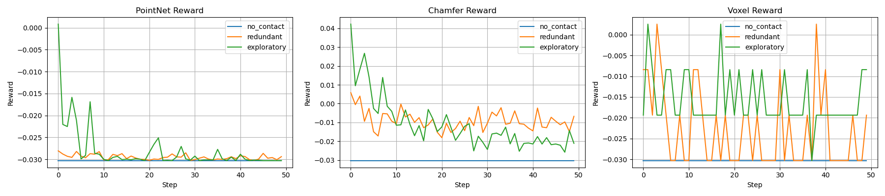

# Reward Function Evaluation

This module evaluates whether our reward function aligns with the intended exploration behavior: **encouraging comprehensive object surface coverage** while **discouraging redundant or overlapping exploration**.

### Objective

Collect 256 tactile contact points that best represent the overall object surface—**uniformly distributed and maximally informative** within a constrained point budget.

At each timestep, newly acquired contact points are merged with the accumulated point cloud. To maintain a consistent size, we apply fast point sampling (Farthest Point Sampling) to retain the most spatially diverse subset.

### Input

The reward function takes 2 things as its input.

* contact(t): current timestep’s contact readings — pressure vectors shaped `[N, x, y, z, fx, fy, fz]`.
* PC(t): accumulated point cloud from timestep 1 to t.


### Reward Designs

We take 3 designs.

#### 1. PointNet discrepancy

```
reward = α * ||PointNet(PC(t)) - PointNet(PC(t-1))|| + β * len(contact(t))
# Euclidean distance between the 2 features
```

Encourages feature diversity over time using PointNet global embeddings and rewards larger, valid contact sets.

**Pros**:

- Sensitive to global geometry.
- Encourages novelty beyond raw distance.

**Cons**:

- Harder to interpret.
- Computationally heavier than raw metrics.
- Rely on quality of trained PointNetEncoder.

#### 2. Chamfer Distance

```
reward = α * Chamfer(PC(t), PC(t-1)) + β * len(contact(t))
```

Uses geometric dissimilarity as a proxy for exploration gain.

**Pros**:

- Intuitive.
- Easier to compute.

**Cons**:

- May reward noisy outliers.
- Ignores semantic shape changes.

#### 3. Surface Occupancy Gain

```
reward = γ * ΔOccupiedVolume(PC(t), PC(t-1)) + β * len(contact(t))
voxel_index = floor(point / voxel_size) # Map PC(t) to a voxel index
ΔOccupiedVolume = len(occupied_voxels(t)) - len(occupied_voxels(t-1))
```

Tracks increase in occupied volume to directly quantify spatial gain. As we only use 256 points, a low resolution voxel map will be applied.

**Pros:**

* Direct spatial metric rather than proxy distance.
* Easy to interprete

**Cons:**

* Resolution trade-off: too coarse: can't differentiate fine details. too fine: duplicates and noise
* Ignores structure: all newly occupied voxels are treated equally -- can't learn to explore special structures.


### Evaluation Protocol

To assess reward effectiveness, we simulate pairs of point clouds at timestep `t` and `t+1` based on ShapeNetCoreV2 data (sampling code from https://github.com/antao97/PointCloudDatasets).

##### Simulation Setup:

- **PC(t)**: choose 1 random point, add its 255 nearest neighbors → simulates poor exploration.
- **PC(t+1)**: create one of three controlled variants:
  1. **No new contact** — identical to PC(t) → should be punished.
  2. **Redundant contact** — 20 new points close to PC(t) → moderately penalized.
  3. **Exploratory contact** — 20 new points far from PC(t) but close to each other → rewarded.

##### Ideal Behavior:

An optimal policy will:

1. First maximize contact quantity.
2. Then diversify spatial coverage.
3. Eventually saturate the object's surface efficiently.


Here’s a complete and polished version of your README `## Testing Result` section, with analysis:

---

### Testing Result

We simulated a 20-step contact collection process using 3 exploration strategies:

- **No Contact**: PC(t) remains identical at every step.
- **Redundant Sampling**: New points are near previously explored areas.
- **Active Exploration**: New points target previously unexplored surface regions.

We evaluate each using three reward functions.

---

#### Reward Curves



#### Simulated Data Collection Process

- [Exploratory](plots_pc/exploratory.mp4)  
- [Redundant](plots_pc/redundant.mp4)

---

#### Analysis

- All 3 reward functions clearly distinguish **contact vs no contact**, confirming their basic responsiveness to tactile feedback.
  
**PointNet Reward**
- **Behavior**: Reward rises early but quickly decays over steps, even in exploratory strategy.
- **Reason**: PointNet global features saturate — once core object shape is captured, further changes produce smaller embedding shifts.
- **Pros**: Good for early-stage reward; captures semantic features beyond raw geometry.
- **Cons**: May prematurely **flatten gradient**, discouraging continued exploration. Risky for long-horizon policy learning unless boosted or shaped.
  
**Chamfer Distance Reward**
- **Behavior**: Responds more linearly to point cloud changes; less sensitive to saturation.
- **Observation**: Exploratory strategy consistently receives moderate rewards, while redundant steps get mildly penalized.
- **Pros**: Smooth, interpretable, and shape-aware.
- **Cons**: Geometric-only — ignores contact forces or semantic utility.
  
**Voxel Occupancy Reward**
- **Behavior**: Severely penalizes redundant exploration (repeats in occupied voxels), but provides consistent reward if any new voxel is touched.
- **Observation**: Doesn’t decay over time — if new voxels are hit, reward remains high.
- **Pros**: Great for enforcing **uniform spatial coverage**.
- **Cons**: Not aware of overall shape; treats all space equally, so it may **overvalue sparse outliers** or noisy detections.

